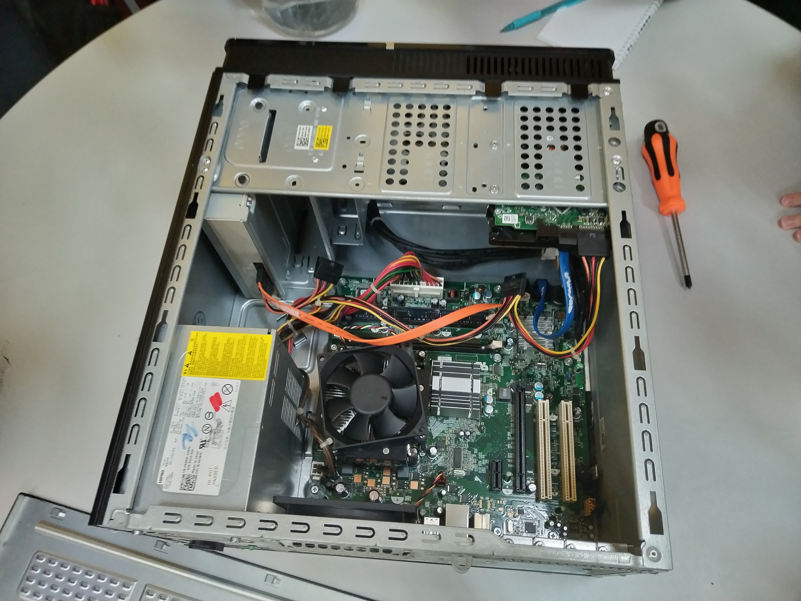

  
   
  <em>Figure 1 </em>

# 💻 My First Hands-On Experience with Computer Assembly

Today, I had the opportunity to attend a workshop on computer component assembly and disassembly.  
It was my first time working directly with the internal parts of a computer — something I’ve always been curious about.  
This experience helped me understand not just the names of the components, but also their functions and how they work together to make a system come alive.

---

## 🧩 Components I Learned About

### 1. **Motherboard**
The motherboard is the main circuit board — the nervous system of the computer.  
It connects every component together and enables communication between the CPU, RAM, storage devices, and peripherals.

### 2. **RAM (Random Access Memory)**
RAM temporarily stores data and instructions that the CPU needs while performing tasks.  
It significantly affects the speed and performance of the system.

### 3. **Hard Disk / SSD (Storage Device)**
The hard disk or SSD is where all files, applications, and the operating system are stored permanently.  
SSDs are faster and more reliable compared to traditional HDDs.

### 4. **Power Supply Unit (PSU)**
The PSU converts electrical power from the wall outlet to the correct voltage levels required by internal components.

### 5. **Cooling Fan**
The cooling fan regulates temperature inside the computer casing.  
It prevents components like the CPU and GPU from overheating.

### 6. **Various Cables**
Cables act as the veins of the system — delivering data and power across components.  
Examples include SATA data cables and multiple power connectors.

---

## 🛠️ The Disassembly Process

I learned how to safely and systematically remove each internal component:

1. **Remove the casing cover**  
   Open the side panel to access the internal hardware.

2. **Unplug all cables**  
   Disconnect data and power cables to prevent damage.

3. **Remove the power supply unit (PSU)**  
   Unscrew and carefully lift the PSU from its compartment.

4. **Remove the RAM modules**  
   Unlock the side clips and pull out the RAM sticks gently.

5. **Remove the hard disk / SSD**  
   Detach it from the bay and unplug SATA connections.

6. **Remove the cooling fan**  
   Unscrew and lift it off, being careful around the motherboard.

---

## 🔄 Reassembly and Testing

After disassembly, I rebuilt the computer step by step:  
- Reattaching the PSU  
- Inserting RAM and storage  
- Connecting all necessary cables  
- Closing the casing  

Once everything was in place, we powered the system back on.  
Seeing the computer boot successfully was a rewarding moment — proof that every connection counted.

---

## 💡 Reflection

This workshop deepened my understanding of how hardware and software rely on each other.  
It wasn’t just about plugging parts together — it was learning how a computer *breathes*.  

As a data engineering student, this hands-on experience strengthens my understanding of computer architecture and helps me appreciate the physical layer behind every digital system I work with.

